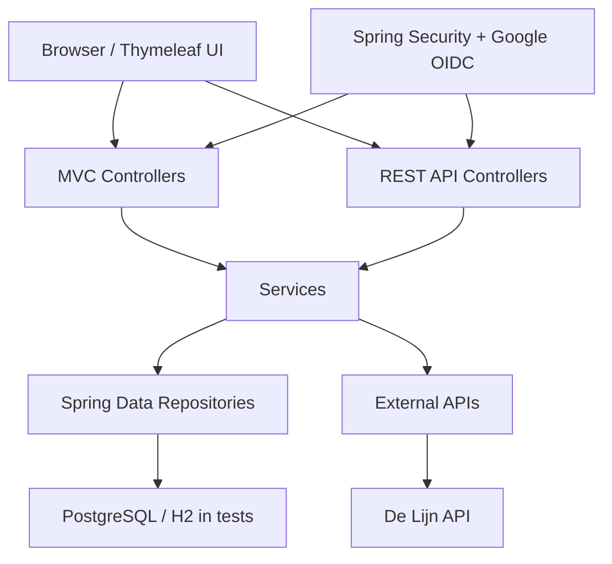

# Architecture

## High-Level Design

TrackTogether follows a conventional Spring Boot layered architecture:

## Main Packages

| Package | Responsibility |
| --- | --- |
| `TrackTogether` | Application bootstrap |
| `TrackTogether.config` | De Lijn REST client and locale configuration |
| `TrackTogether.controller` | Server-rendered Thymeleaf page controllers |
| `TrackTogether.controller.ModelView` | View models for admin pages |
| `TrackTogether.domain` | JPA entities and enums |
| `TrackTogether.dto` | Application view DTOs |
| `TrackTogether.dto.analytics` | Analytics read models |
| `TrackTogether.dto.delijn` | De Lijn API DTOs |
| `TrackTogether.exceptions` | Application exceptions |
| `TrackTogether.repository` | Spring Data JPA repositories |
| `TrackTogether.security` | Authentication, provisioning, account status and sessions |
| `TrackTogether.service` | Business services |
| `TrackTogether.service.delijn` | De Lijn API integration and parsing |
| `TrackTogether.view` | Form backing objects |
| `TrackTogether.webapi` | JSON REST API controllers |
| `TrackTogether.webapi.dto` | REST request and response DTOs |
| `TrackTogether.webapi.mapper` | REST DTO mappers |

## Request Flow

1. A user signs in with Google OAuth2.
2. `ProvisioningUserService` loads or creates the corresponding `Member`.
3. Role authorities are derived from the role tables: `moderator`, `admin`, and `super_admin`.
4. Page requests go through MVC controllers and render Thymeleaf templates.
5. JSON requests go through REST controllers in `TrackTogether.webapi`.
6. Controllers call services for business rules.
7. Services use repositories for persistence and may call helper services such as notifications, analytics, matching, or De Lijn.

## Controller Types

### MVC Controllers

MVC controllers return template names and are used by normal browser pages.

Examples:

- `MainController`: home page.
- `ActivityController`: activity list, create, detail, delete.
- `TravelGroupController`: travel group workflows.
- `ChatController`: direct chat, travel group chat, custom group chat.
- `ModeratorController`: moderation pages.
- `SuperAdminController`: user, activity, settings and admin dashboards.

### REST API Controllers

REST controllers return JSON and are used by frontend JavaScript and API clients.

Examples:

- `TravelGroupApiController`
- `DeLijnApiController`
- `ModeratorApiController`
- `NotificationApiController`
- `MemberApiController`
- `SuperAdminApiController`

## Service Responsibilities

| Service | Responsibility |
| --- | --- |
| `ActivityService` | Activity visibility, creation, deletion, KdG activity checks |
| `ActivityPolicyService` | Activity visibility and KdG-created activity policy |
| `AdminService` | Admin lookup helpers |
| `AnalyticsService` | User/admin analytics and CO2 calculations |
| `ConversationService` | Direct, travel group, and custom group chat membership |
| `CurrentUserService` | Resolve the authenticated `Member` |
| `FriendMatchingService` | Suggested travel groups for the current user |
| `GoogleCalendarLinkService` | Google Calendar URL creation for travel groups |
| `HomePageService` | Personalized home page data |
| `MemberService` | Member lookup and travel preferences |
| `MessageService` | Message sending and loading |
| `ModeratorService` | Report assignment, status changes, history, chat context |
| `NotificationService` | Notification creation, unread counts, read status |
| `ReportService` | Message report creation |
| `RoleService` | Updates role tables for members |
| `SuperAdminService` | User management, role changes, activity verification |
| `SystemSettingsService` | Singleton system settings |
| `TravelGroupRouteSuggestionService` | Route suggestion response building |
| `TravelGroupService` | Main travel group workflows and rules |
| `DeLijnService` | Calls and parses De Lijn APIs |

## Persistence

The app uses Spring Data JPA repositories over PostgreSQL in normal development and production.

Test runs use an in-memory H2 database in PostgreSQL compatibility mode.

Important persistence patterns:

- `User` uses joined inheritance for `Member` and `Moderator`.
- `Admin` and `SuperAdmin` are separate role marker tables keyed by user id.
- `TravelGroupRepository.findByIdForUpdate` uses a pessimistic lock for seat-sensitive operations.
- `TravelGroupMember` has a unique group/member constraint.
- `JoinRequest` has a unique group/member constraint.
- `MemberConversation` has a unique conversation/member constraint.
- Several repositories use entity graphs or grouped count queries to avoid repetitive database calls.

## External Integrations

| Integration | Location | Notes |
| --- | --- | --- |
| Google OAuth2/OIDC | `security` package and Spring Security config | Login and user provisioning |
| De Lijn | `service.delijn`, `config.DeLijnConfig` | Stops, departures, route options, debug endpoints |
| Google Calendar | `GoogleCalendarLinkService` | Builds calendar URLs, no server-side API call |

## Frontend Architecture

The UI is server-rendered with Thymeleaf and enhanced with JavaScript.

Static files:

- `src/main/resources/static/css/main.css`
- `src/main/resources/static/js/*.js`
- `src/main/resources/static/images/logo.png`

Templates:

- Full pages live in `src/main/resources/templates`.
- Shared parts live in `src/main/resources/templates/fragments`.
- Error pages live in `src/main/resources/templates/error`.

