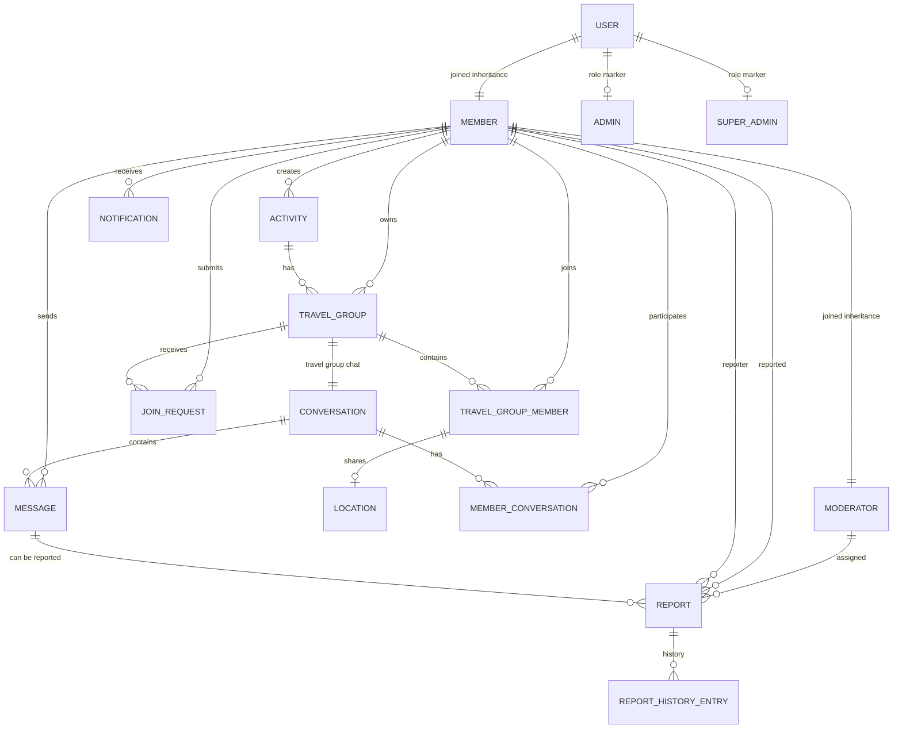

# Domain Model

## Entity Relationship Overview

## Core Entities

### User

`User` is the abstract base entity mapped to the `users` table.

Important fields:

- `userId`: UUID primary key.
- `originalId`: unique external id, usually `GOOGLE-` plus the Google subject.
- `name`
- `email`
- `status`: active or disabled account.

### Member

`Member` extends `User` and represents a normal application user.

Important fields:

- `co2Saved`
- `preferredTransportMode`
- `defaultDepartureLocation`
- `defaultLatitude`
- `defaultLongitude`

The travel preferences are used by matching and public transport suggestions.

### Moderator

`Moderator` extends `Member`. A moderator can review message reports. The effective `ROLE_MODERATOR` authority can also be granted to admins and super admins during login provisioning.

### Admin and SuperAdmin

`Admin` and `SuperAdmin` are role marker entities. They store only a `userId`.

Current role hierarchy in provisioning:

- Every logged-in member gets `ROLE_USER`.
- Moderator, admin, and super admin users get `ROLE_MODERATOR`.
- Admin and super admin users get `ROLE_ADMIN`.
- Super admin users get `ROLE_SUPER_ADMIN`.

### Activity

An activity is an event that members can travel to.

Important fields:

- `id`
- `name`
- `description`
- `location`
- `distanceKm`
- `latitude`
- `longitude`
- `date`
- `time`
- `verificationStatus`
- `creator`

Verification statuses:

- `PENDING`
- `APPROVED`
- `DISAPPROVED`

Only approved activities are visible to everyone. A pending or disapproved activity is visible to its creator.

### TravelGroup

A travel group is a shared trip to an activity.

Important fields:

- `groupId`
- `transportMode`
- `location`
- `maxMembers`
- `departureLocation`
- `departureLatitude`
- `departureLongitude`
- `arrivalLatitude`
- `arrivalLongitude`
- `departureTime`
- `estimatedArrivalTime`
- `activity`
- `owner`
- `conversation`
- `members`

Transport modes:

- `CAR`
- `CARPOOL`
- `BIKE`
- `WALK`
- `PUBLIC_TRANSPORT`

Key rule: `hasAvailableSpots(currentMembers)` checks whether the group still has space.

### TravelGroupMember

Join entity between `TravelGroup` and `Member`.

Important fields:

- `id`
- `group`
- `member`
- `location`

Constraints:

- The pair `group_id` and `member_id` is unique.
- A membership can own one shared `Location`.

### Location

Represents a member's shared location inside a travel group.

Important fields:

- `address`
- `latitude`
- `longitude`
- `timestamp`

### JoinRequest

Represents a pending, accepted, or rejected request to join a travel group.

Important fields:

- `id`
- `group`
- `member`
- `status`
- `requestedAt`
- `respondedAt`

Statuses:

- `PENDING`
- `ACCEPTED`
- `REJECTED`

The pair `group_id` and `member_id` is unique.

### TravelGroupActivityLog

Stores a history entry for important group actions.

Types:

- `CREATED`
- `JOINED`
- `LEFT`
- `UPDATED`
- `OWNERSHIP_TRANSFERRED`
- `JOIN_REQUESTED`
- `JOIN_REQUEST_ACCEPTED`
- `JOIN_REQUEST_REJECTED`

### Conversation

Represents a chat.

Important fields:

- `conversationId`
- `createdAt`
- `title`
- `type`
- `travelGroup`
- `members`
- `messages`

Types:

- `DIRECT`: one-to-one chat.
- `TRAVEL_GROUP`: chat attached to a travel group.
- `CUSTOM_GROUP`: standalone group chat with a title and owner/member roles.

If `type` is null for older rows, the getter falls back to `DIRECT` when there is no travel group and `TRAVEL_GROUP` when a travel group is present.

### MemberConversation

Join entity between `Conversation` and `Member`.

Important fields:

- `id`
- `conversation`
- `member`
- `role`

Roles:

- `OWNER`
- `MEMBER`

The pair `conversation_id` and `member_id` is unique.

### Message

A chat message.

Important fields:

- `messageId`
- `message`
- `timeStamp`
- `conversation`
- `sender`
- `reports`

### Report

A moderation report for a message.

Important fields:

- `reportId`
- `reason`
- `createdAt`
- `status`
- `moderator`
- `reported`
- `reporter`
- `message`

Statuses:

- `OPEN`
- `REVIEWED`
- `RESOLVED`
- `REJECTED`

### ReportHistoryEntry

Records report status transitions and assignment actions.

Important fields:

- `id`
- `report`
- `fromStatus`
- `toStatus`
- `changedBy`
- `changedAt`

### Notification

Stores a notification for a member.

Important fields:

- `id`
- `recipient`
- `type`
- `actorName`
- `groupLocation`
- `groupId`
- `createdAt`
- `read`

Types:

- `MEMBER_JOINED`
- `MEMBER_LEFT`
- `GROUP_FULL`
- `JOIN_REQUEST_RECEIVED`
- `JOIN_REQUEST_ACCEPTED`
- `JOIN_REQUEST_REJECTED`
- `NEW_MESSAGE`

### SystemSettings

Singleton platform settings row.

Important fields:

- `id`: fixed to `1`
- `travelGroupJoinApprovalEnabled`

